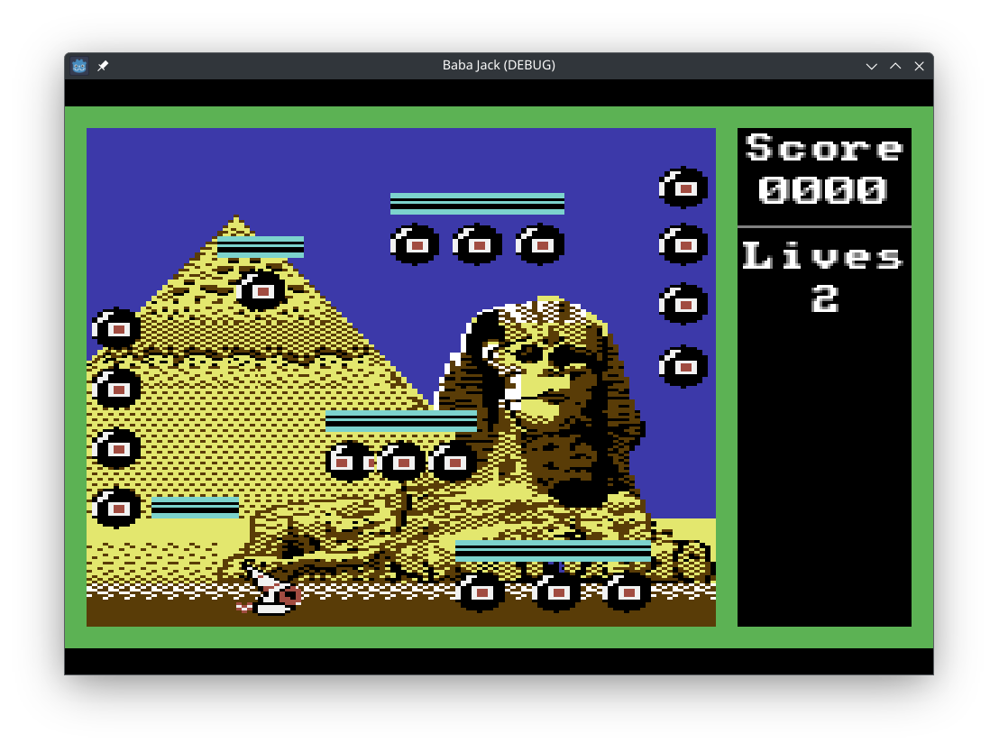

# Baba - Jack

Game dev training inspired by Bomb-jack



## Features

Use the arrows to move jack and space to jump. Escape to go back to the menu.

## Getting Started

### Prerequisites

- [Godot Engine 4.4](https://godotengine.org/download)

### Installation

1. **Clone the repository:**

    ```
    git clone https://github.com/peebam/baba-jack
    ```

2. **Open the project in Godot Engine 4.4.**

3. **Run the project.**
